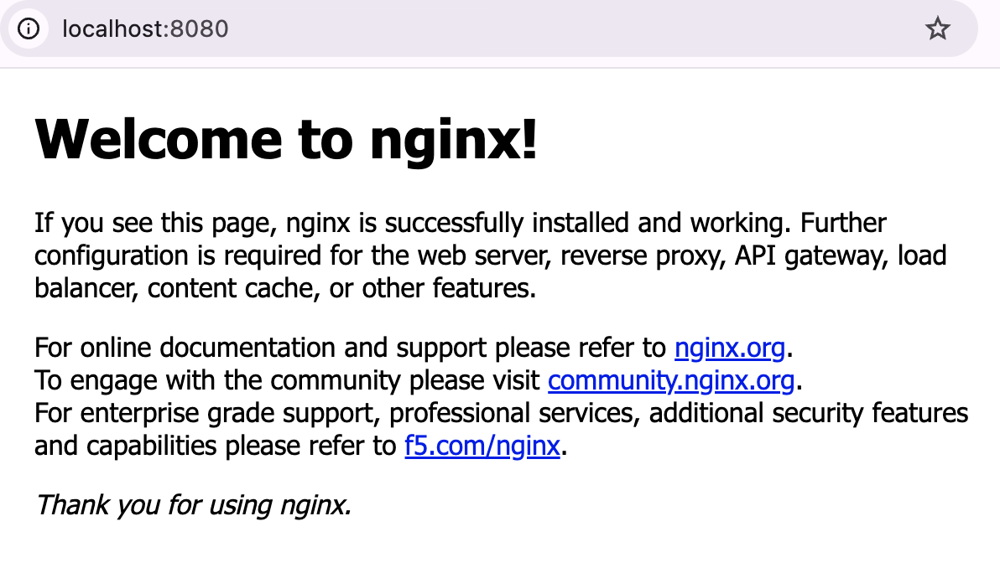
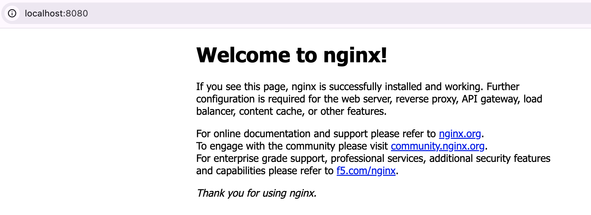
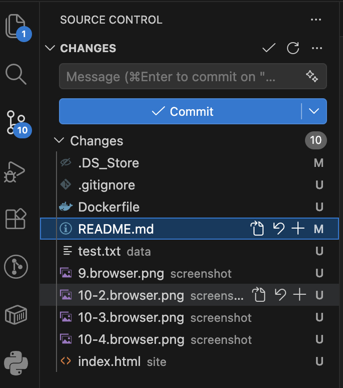
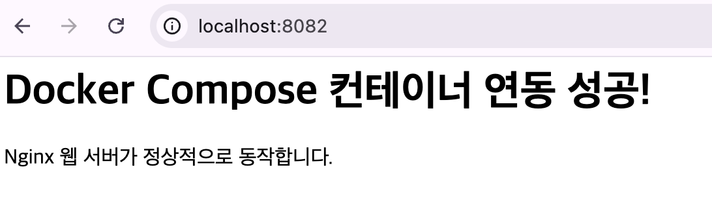
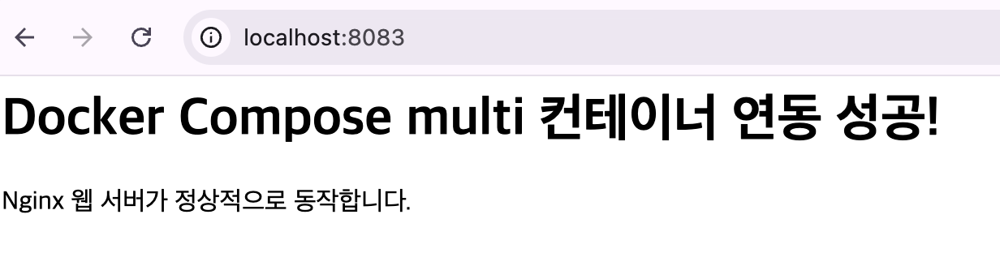
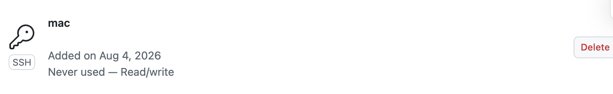
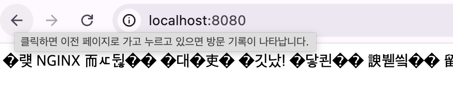

# 개발 워크스테이션 구축 미션

## 목차

1. [프로젝트 개요](#1-프로젝트-개요)
2. [실행 환경](#2-실행-환경)
3. [수행 체크리스트](#3-수행-체크리스트)
4. [터미널 조작 로그](#4-터미널-조작-로그)
5. [권한 실습](#5-권한-실습)
6. [Docker 설치 및 기본 점검](#6-docker-설치-및-기본-점검)
7. [컨테이너 실행 실습](#7-컨테이너-실행-실습)
8. [Dockerfile 기반 커스텀 이미지](#8-dockerfile-기반-커스텀-이미지)
9. [포트 매핑 접속 증거](#9-포트-매핑-접속-증거)
10. [바인드 마운트 검증](#10-바인드-마운트-검증)
11. [Docker 볼륨 영속성 검증](#11-docker-볼륨-영속성-검증)
12. [Git 설정 및 GitHub 연동](#12-git-설정-및-github-연동)
13. [보너스 과제 (선택)](#13-보너스-과제-선택)
14. [트러블슈팅](#14-트러블슈팅)
15. [결과 정리](#15-결과-정리)

## 프로젝트 파일 구조

```bash
cds-w1-mi/
├── cody/
│   └── cody1.txt
│   └── cody1.txt
├── compose/
│   └── docker-compose.yml
│   └── index.html
├── compose_env/
│   └── .env
│   └── docker-compose.yml
│   └── index.html
├── compose_multi/
│   └── docker-compose.yml
│   └── index.html
├── data/
│   └── test.txt
├── site/
│   └── index.html
├── .gitignore
├── Dockerfile
├── README.md
└── empty.txt
```

## 1. 프로젝트 개요

이 프로젝트는 터미널, Docker, Git/GitHub를 활용해 개발 워크스테이션 환경을 직접 구성하고 검증한 기록입니다.

학습 목표:
- 리눅스 CLI 기본 조작 익히기
- 파일/디렉토리 권한 이해하기
- Docker 설치 및 기본 운영 명령 익히기
- Dockerfile 기반 커스텀 이미지 만들기
- 포트 매핑, 바인드 마운트, 볼륨 영속성 확인하기
- Git 설정 및 GitHub 연동 확인하기

---

## 2. 실행 환경

- OS: `macOS`
- Shell: `bash zsh`
- Terminal: `Terminal`
- Docker: `OrbStack, Docker version 28.5.2`
- Git: `git version 2.53.0`

### 버전 확인 명령
```bash
% uname -a
Darwin /RELEASE_X86_64 x86_64
```
```bash
% git --version
git version 2.53.0
```
```bash
% git config --list
credential.helper=osxkeychain
user.name=raffi0922
user.email=***@gmail.com
core.repositoryformatversion=0
core.filemode=true
core.bare=false
core.logallrefupdates=true
core.ignorecase=true
core.precomposeunicode=true
remote.origin.url=https://github.com/raffi0922/cds-w1-m1.git
remote.origin.fetch=+refs/heads/*:refs/remotes/origin/*
branch.main.remote=origin
branch.main.merge=refs/heads/main
branch.main.vscode-merge-base=origin/main
```
```bash
% docker --version
Docker version 28.5.2, build ecc6942
```
```bash
% echo $SHELL
/bin/zsh
```
```bash
% docker info
Client:
Version:    28.5.2
Context:    orbstack
Debug Mode: false
Plugins:
  buildx: Docker Buildx (Docker Inc.)
    Version:  v0.29.1
    Path:     /Users/hyeonmo90922/.docker/cli-plugins/docker-buildx
  compose: Docker Compose (Docker Inc.)
    Version:  v2.40.3
    Path:     /Users/hyeonmo90922/.docker/cli-plugins/docker-compose
```

---

## 3. 수행 체크리스트

- [✅] 현재 위치 확인 및 디렉토리 이동
- [✅] 파일/디렉토리 생성, 복사, 이동, 삭제
- [✅] 숨김 파일 확인
- [✅] 파일 내용 확인 및 빈 파일 생성
- [✅] 파일/디렉토리 권한 확인 및 변경
- [✅] Docker 버전 확인
- [✅] Docker 데몬 동작 확인
- [✅] `hello-world` 실행
- [✅] `nginx:alpine` 컨테이너 실행 및 내부 명령 확인
- [✅] Docker 이미지 목록 확인
- [✅] 컨테이너 실행/중지/목록 확인
- [✅] `docker logs`, `docker ps` 확인
- [✅] Dockerfile 기반 커스텀 이미지 빌드
- [✅] 포트 매핑 접속 확인
- [✅] 바인드 마운트 반영 확인
- [✅] Docker 볼륨 영속성 확인
- [✅] Git 사용자 정보/기본 브랜치 설정
- [✅] GitHub 저장소 연동

---

## 4. 터미널 조작 로그

### 4-1. 현재 위치 확인 / 목록 확인
```bash
# 현재위치
% pwd
/Users/hyeonmo90922/proejct
# 목록
% ls
README.md
# 숨김파일 포함
% ls -al 
total 24
drwxr-xr-x   4 hyeonmo90922  hyeonmo90922   128  7 29 15:17 .
drwxr-xr-x   5 hyeonmo90922  hyeonmo90922   160  7 29 15:41 ..
drwxr-xr-x  12 hyeonmo90922  hyeonmo90922   384  7 29 15:43 .git
-rw-r--r--@  1 hyeonmo90922  hyeonmo90922  8694  7 29 16:11 README.md
```

### 4-2. 디렉토리 이동 / 생성 / 복사 / 이름 변경 / 삭제
```bash
% mkdir cody # 생성
% cd cody # 디렉토리 이동
% touch cody.txt # 생성
% cp cody.txt cody2.txt # 복사
% mv cody.txt cody1.txt # 이름 변경
% ls     
cody1.txt	cody2.txt
% cp cody2.txt cody3.txt # 복사
% rm cody3.txt # 삭제
% mkdir sub # 디렉토리 생성
% ls
cody1.txt	cody2.txt	sub
% rm -r sub # 디렉토리 삭제
```

### 4-3. 파일 내용 확인 / 빈 파일 생성
```bash
% touch empty.txt # 빈 파일 생성
% echo "test" > empty.txt # 파일 내용 확인
% cat empty.txt 
test
```

---

## 5. 권한 실습

### 5-1. 파일 권한 확인 및 변경
소유자(user), 그룹(group), 다른사용자(others)
(7) = 읽기(4), 쓰기(2), 실행(1) 모든 권한
- `644 rw- r-- r--` : 소유자 수정가능, 나머지 읽기만
- `755 rwx r-x r-x` : 소유자 수정가능, 나머지 읽기+실행
대상 파일: `emmpty.txt`

```bash
% ls -l empty.txt # 644 
-rw-r--r--  1 hyeonmo90922  hyeonmo90922  5  7 29 16:59 empty.txt
% chmod 755 empty.txt # 권한 변경 755
% ls -l empty.txt    
-rwxr-xr-x  1 hyeonmo90922  hyeonmo90922  5  7 29 16:59 empty.txt
```

### 5-2. 디렉토리 권한 확인 및 변경
대상 디렉토리: `cody`

```bash
% ls -ld cody        
drwxr-xr-x  4 hyeonmo90922  hyeonmo90922  128  7 29 16:40 cody
% chmod 755 cody
% ls -ld cody
drwxr-xr-x  4 hyeonmo90922  hyeonmo90922  128  7 29 16:40 cody
```

---

## 6. Docker 설치 및 기본 점검


### 6-1. OrbStack

- OrbStack은 맥(macOS) 환경에서 도커(Docker) 컨테이너와 리눅스(Linux) 가상 머신을 매우 빠르고 가볍게 실행할 수 있다
- 고성능 가상화 도구로, 뛰어난 속도, 적은 자원 사용량, 그리고 편리한 네트워크 기능을 제공

📌 도커 이미지 (Image): 앱 실행에 필요한 파일과 설정이 들어 있는 읽기 전용 틀(템플릿)
- 비유: 요리책의 레시피 또는 붕어빵 틀
- 특징: 수정할 수 없고, 파일 형태로 저장되며 용량을 차지함\

📌 도커 컨테이너 (Container): 이미지를 실행해 동작시키는 독립된 공간(런타임)
- 비유: 레시피를 보고 실제로 만든 요리 또는 구워낸 붕어빵
- 특징: 데이터를 바꾸거나 지워도 원래 이미지에는 영향을 주지 않음

### 6-2. 설치 방법 
홈브루(Homebrew)로 설치하기  
```bash
% brew install orbstack
```
```bash
# docker 데몬 학인
% docker
Usage:  docker [OPTIONS] COMMAND
A self-sufficient runtime for containers
...(생락)
```

### 6-3. docker 기본 명령
```bash
# 컨테이너
% docker ps
CONTAINER ID   IMAGE     COMMAND   CREATED   STATUS    PORTS     NAMES
# 이미지
% docker images
REPOSITORY   TAG       IMAGE ID   CREATED   SIZE
# 실행 중인 컨테이너의 CPU, 메모리, 네트워크, 디스크 I/O 등 실시간 리소스 사용량 통계 스트림
% docker stats
CONTAINER ID   NAME      CPU %     MEM USAGE / LIMIT   MEM %     NET I/O   BLOCK I/O   PIDS
```

---

## 7. 컨테이너 실행 실습

### 7-1. hello-world 이미지 다운로드, 컨테이너 실행 및 내부 명령 실행

-  hello-world 는 도커 설치 후 정상 작동 여부를 확인하기 위해 실행하는 기본 테스트용 컨테이너 이미지

```bash
# hello-world 이미지 다운로드
% docker pull hello-world 
Using default tag: latest
latest: Pulling from library/hello-world
4f55086f7dd0: Pull complete 
Digest: sha256:c3cbe1cc1aa588a64951ac6286e0df7b27fe2e6324b1001c619bb358770c0178
Status: Downloaded newer image for hello-world:latest
docker.io/library/hello-world:latest
```

- -d의 옵션 의미: Detach(분리)의 약자로, 컨테이너를 터미널과 분리하여 백그라운드에서 실행하고 컨테이너 ID만 출력하도록 하는 옵션

```bash
# hello-world 컨테이너 실행 및 내부 명령 실행
% docker run -d --name my-web hello-world 
fbe5c2fa72a57baad54d996a073f7345d65e37afd64cae5a2cda57aae550006b
% docker ps
CONTAINER ID   IMAGE     COMMAND   CREATED   STATUS    PORTS     NAMES
% docker ps -a
CONTAINER ID   IMAGE         COMMAND    CREATED              STATUS                          PORTS     NAMES
fbe5c2fa72a5   hello-world   "/hello"   About a minute ago   Exited (0) About a minute ago             my-web
```

### 7-2. nginx:alpine 이미지 다운로드, 컨테이너 실행 및 내부 명령 실행

```bash
# nginx:alpine 이미지 다운로드
% docker pull nginx:alpine
alpine: Pulling from library/nginx
55afa1ecc21d: Pull complete 
3cd534fe98c6: Pull complete 
1223f016b4e4: Pull complete 
62bec68d7c31: Pull complete 
46f977ee452f: Pull complete 
d0008c891db4: Pull complete 
390dc935348d: Pull complete 
46519e7231d2: Pull complete 
Digest: sha256:4a73073bd557c65b759505da037898b61f1be6cbcc3c2c3aeac22d2a470c1752
Status: Downloaded newer image for nginx:alpine
docker.io/library/nginx:alpine
```


- 도커에서 -p 8080:80과 같이 포트를 매핑할 때, 구조는 항상 -p [호스트 포트]:[컨테이너 포트] 형식을 따른다.
- 호스트(Host)는 내 실제 컴퓨터(PC 또는 서버)를 의미하고, 컨테이너(Container)는 도커 안에서 독립적으로 실행되는 가상 공간을 의미한다.

```bash
# nginx:alpine 컨테이너 실행 및 내부 명령 실행
% docker run -d -p 8080:80 --name my-nginx nginx:alpine
22c9f60c5ca904dcf8a450c11bcd1808bcbb0c753eed83292f814067aa98c2c5
```



### 7-3. ubuntu 이미지 다운로드, 컨테이너 실행 및 내부 명령 실행
```bash
# ubuntu 이미지 다운로드
 % docker pull ubuntu                                
Using default tag: latest
latest: Pulling from library/ubuntu
ed819469700f: Pull complete 
a3679419df18: Pull complete 
Digest: sha256:3131b4cc82a783df6c9df078f86e01819a13594b865c2cad47bd1bca2b7063bb
Status: Downloaded newer image for ubuntu:latest
docker.io/library/ubuntu:latest
```

- i (Interactive, 표준 입력 유지)컨테이너가 켜져 있는 동안 사용자의 키보드 입력(표준 입력, STDIN)을 계속 붙잡아 두고 컨테이너에 전달하는 역할.이 옵션이 없으면 명령어를 입력해도 컨테이너가 사용자의 입력을 받지 못합니다.
- t (TTY, 가상 터미널 할당)리눅스 환경의 터미널 화면(가상 TTY)을 컨테이너 내부에 만들어 주는 역할.이 옵션 덕분에 터미널 화면에 알록달록한 색상이 나오고, 행 바꿈이 예쁘게 정렬되며, 명령어 자동 완성을 돕는 Tab 키나 이전 명령어를 보여주는 방향키(↑, ↓)를 사용할 수 있게 됩니다.

```bash
# ubuntu 컨테이너 실행 및 내부 명령 실행
% docker run -it --name my-ubuntu ubuntu      
root@da6e4695b9cc:/# ls
bin  boot  dev  etc  home  lib  lib64  media  mnt  opt  proc  root  run  sbin  srv  sys  tmp  usr  var
root@da6e4695b9cc:/# echo "hello docker"
hello docker
root@da6e4695b9cc:/# exit
exit
% docker ps
CONTAINER ID   IMAGE     COMMAND   CREATED   STATUS    PORTS     NAMES
```

### 7-4. 이미지 / 컨테이너 상태 확인
```bash
% docker images                                     
REPOSITORY    TAG       IMAGE ID       CREATED        SIZE
nginx         alpine    f0ba77f796e5   2 weeks ago    62.4MB
ubuntu        latest    de7345b16e94   2 weeks ago    100MB
hello-world   latest    e2ac70e7319a   4 months ago   10.1kB
% docker ps
CONTAINER ID   IMAGE          COMMAND                   CREATED         STATUS         PORTS                                     NAMES
22c9f60c5ca9   nginx:alpine   "/docker-entrypoint.…"   8 minutes ago   Up 8 minutes   0.0.0.0:8080->80/tcp, [::]:8080->80/tcp   my-nginx
% docker ps -a                          
CONTAINER ID   IMAGE          COMMAND                   CREATED         STATUS                          PORTS                                     NAMES
da6e4695b9cc   ubuntu         "/bin/bash"               2 minutes ago   Exited (0) About a minute ago                                             my-ubuntu
22c9f60c5ca9   nginx:alpine   "/docker-entrypoint.…"   8 minutes ago   Up 8 minutes                    0.0.0.0:8080->80/tcp, [::]:8080->80/tcp   my-nginx
```

### 7-5. attach / exec / 종료 차이 
📌 개념 정리
| 구분	| attach | exec |
|---|---|---|
| 목적	| 실행 중인 컨테이너의 표준입출력에 연결 |	컨테이너 내에서 새로운 프로세스 실행 |
| 상호작용|	메인 프로세스와 직접 상호작용	| 독립적인 새 프로세스 실행 |
| 종료 시|	메인 프로세스 종료 → 컨테이너 중지	| 새 프로세스만 종료 → 컨테이너 계속 실행 |
| 사용 사례	|로그 실시간 확인, 포그라운드 프로세스 모니터링	| 디버깅, 명령 실행, 셸 접속 |
| 위험도	| ⚠️ 높음 (실수로 종료 가능) |	✅ 안전함 |


❓ 왜 attach 를 사용하냐?
attach로 들어간 상태에서 exit를 입력하거나 Ctrl + C를 누르면, 백그라운드 환경이 종료되는 것이 아니라 컨테이너의 메인 프로세스(PID 1) 자체가 종료됩니다. 메인 프로세스가 죽기 때문에 컨테이너도 함께 멈추는 것입니다.(※ 컨테이너를 종료하지 않고 빠져나오려면 Ctrl + P, Q를 순서대로 눌러야 합니다.)

🔴 attach 사용 (위험한 방식)

1️⃣ nginx:alpine 컨테이너 실행
```bash
% docker start my-nginx                                
my-nginx
```

2️⃣ 컨테이너 상태 확인
```bash
% docker ps
CONTAINER ID   IMAGE          COMMAND                   CREATED             STATUS         PORTS                                     NAMES
22c9f60c5ca9   nginx:alpine   "/docker-entrypoint.…"   About an hour ago   Up 7 seconds   0.0.0.0:8080->80/tcp, [::]:8080->80/tcp   my-nginx
```

3️⃣ 컨테이너는 메인 프로세스 접속 후 중지
```bash
% docker attach my-nginx
2026/08/04 05:21:49 [notice] 1#1: signal 28 (SIGWINCH) received
2026/08/04 05:21:49 [notice] 1#1: signal 28 (SIGWINCH) received
2026/08/04 05:21:49 [notice] 1#1: signal 28 (SIGWINCH) received
2026/08/04 05:21:49 [notice] 1#1: signal 28 (SIGWINCH) received
# Ctrl+C를 누르면...(생략)
2026/08/04 05:22:40 [notice] 1#1: exit
```

4️⃣ ⚠️ 컨테이너 체크!
```bash
% docker ps
CONTAINER ID   IMAGE     COMMAND   CREATED   STATUS    PORTS     NAMES
# 컨테이너가 사라짐! (중지됨)
```
attach로 메인 프로세스에 연결됨
Ctrl+C를 누르면 메인 프로세스 자체가 종료됨
메인 프로세스 종료 → 컨테이너 자동 중지

-it 옵션으로 가상 터미널 할당 후 ^P^Q 로 빠져나오기
```bash
% docker run -it -d --name my-nginx2 nginx:alpine 
2902ed04b87ac1dac61e83994d65e3c2f30c8c9d78086be7d79cedb4a73fe2f5
 % docker ps
CONTAINER ID   IMAGE          COMMAND                   CREATED          STATUS          PORTS     NAMES
2902ed04b87a   nginx:alpine   "/docker-entrypoint.…"   42 seconds ago   Up 41 seconds   80/tcp    my-nginx2
```


🟢 exec 사용 (안전한 방식)

1️⃣ nginx:alpine 컨테이너 다시 실행
```bash
% docker start my-nginx 
my-nginx
```

```bash
% docker ps                                          
CONTAINER ID   IMAGE          COMMAND                   CREATED       STATUS          PORTS                                     NAMES
22c9f60c5ca9   nginx:alpine   "/docker-entrypoint.…"   2 hours ago   Up 2 seconds   0.0.0.0:8080->80/tcp, [::]:8080->80/tcp   my-nginx
```

2️⃣ exec로 새 프로세스 실행 후 중지
```bash
 % docker exec my-nginx cat /var/log/nginx/access.log
^C%   
```

3️⃣  컨테이너는 여전히 실행 중
```bash
% docker ps                                         
CONTAINER ID   IMAGE          COMMAND                   CREATED       STATUS              PORTS                                     NAMES
22c9f60c5ca9   nginx:alpine   "/docker-entrypoint.…"   2 hours ago   Up About a minute   0.0.0.0:8080->80/tcp, [::]:8080->80/tcp   my-nginx
# 상태: Up a minutes = 계속 실행 중! ✅
```

---

## 8. Dockerfile 기반 커스텀 이미지

### 8-1. nginx 커스텀 베이스 이미지
- 베이스 이미지: `nginx:alpine`
이유: 경량(42.5MB), 보안 업데이트 빠름, 웹 서버 기본 기능 포함
(선택)
- 웹서버 `HTML 정적 파일 교체` `설정 파일 변경`
- 리눅스 `환경변수 추가` `헬스체크 추가`

### 8-2. 정적 콘텐츠 준비

```bash
# 생성
% cat > site/index.html << 'EOF'
<html>
<head>
    <meta charset="UTF-8">
    <title>NGINX 커스텀 이미지</title>
</head>
<body>
<h1>🎉 NGINX 커스텀 이미지 성공!</h1>
<p>이것은 바인드 마운트로 반영된 콘텐츠입니다.</p>
</body>
</html>
EOF
# 입력 확인
% cat site/index.html           
<html>
<head>
    <meta charset="UTF-8">
    <title>NGINX 커스텀 이미지</title>
</head>
<body>
<h1>🎉 NGINX 커스텀 이미지 성공!</h1>
<p>이것은 바인드 마운트로 반영된 콘텐츠입니다.</p>
</body>
</html>
```

### 8-3. 프로젝트 구조
```bash
project/
├── Dockerfile
├── site/
│   └── index.html
└── README.md
```

### 8-4. Dockerfile
```Dockerfile
% cat > Dockerfile << 'EOF'
FROM nginx:alpine

LABEL org.opencontainers.image.title="my-custom-nginx"
LABEL org.opencontainers.image.version="1.0"

#환경 변수 설정
ENV APP_ENV=development
ENV NGINX_PORT=80

#정적 콘텐츠 복사
COPY site/ /usr/share/nginx/html/

EXPOSE 80

CMD ["nginx", "-g", "daemon off;"]
EOF
```

커스텀 포인트 설명:
|항목|목적|
|---|---|
|FROM nginx:alpine	| 경량 웹 서버 베이스|
|LABEL	| 이미지 메타데이터 추가|
|ENV	| 환경 변수로 설정 외부화|
|COPY site/|	호스트 콘텐츠를 컨테이너로 복사|
|HEALTHCHECK|	컨테이너 상태 자동 감시|
EXPOSE 80|	포트 문서화|
|CMD| 도커 이미지 빌드 후, 컨테이너가 시작될 때 기본적으로 실행할 명령어를 지정하는 지시어|
nginx: 웹 서버 프로그램인 Nginx를 실행하는 메인 명령어  
-g: Nginx의 전역 설정(Global configuration) 지시어를 외부에서 직접 주입하겠다는 옵션  
daemon off: Nginx를 백그라운드(Daemon)가 아닌 사용자의 눈에 보이는 포그라운드(Foreground) 상태로 실행하라는 설정  

### 8-5. 빌드 명령
```bash
 % docker build -t my-custom-nginx:1.0 .
[+] Building 2.1s (7/7) FINISHED                                                docker:orbstack
 => [internal] load build definition from Dockerfile                                       0.2s
 => => transferring dockerfile: 330B   
...(생략)
 => => naming to docker.io/library/my-custom-nginx:1.0 
```

```bash
% docker images | grep my-custom-nginx
my-custom-nginx   1.0       5df2d5102d4e   51 seconds ago   62.4MB
```

### 8-6. 실행 명령 (포트 매핑) , 컨테이너 확인
```bash
# 실행 명령 (포트 매핑)
% docker run -d -p 8079:80 --name my-nginx-server my-custom-nginx:1.0
6d75e498e0d8bd0ea5c894d84bd64b793b47156aeeac572a216c0cc3d7814e67
```

```bash
# 컨테이너 확인
% docker ps
CONTAINER ID   IMAGE                 COMMAND                   CREATED          STATUS          PORTS                                     NAMES
6d75e498e0d8   my-custom-nginx:1.0   "/docker-entrypoint.…"   16 seconds ago   Up 15 seconds   0.0.0.0:8079->80/tcp, [::]:8079->80/tcp   my-nginx-server
```

---

## 9. 포트 매핑 접속 증거

### 접속 확인 명령
```bash
% curl http://localhost:8079
<html>
<head>
    <meta charset="UTF-8">
    <title>NGINX 커스텀 이미지</title>
</head>
<body>
<h1>🎉 NGINX 커스텀 이미지 성공!</h1>
<p>이것은 바인드 마운트로 반영된 콘텐츠입니다.</p>
</body>
</html>
```

### 브라우저 접속 증거
- 접속 주소: `http://localhost:8079`
- ✅ 스크린샷  

---

### 로그 확인
```bash
% docker logs my-nginx-server
/docker-entrypoint.sh: /docker-entrypoint.d/ is not empty, will attempt to perform configuration
/docker-entrypoint.sh: Looking for shell scripts in /docker-entrypoint.d/
/docker-entrypoint.sh: Launching /docker-entrypoint.d/10-listen-on-ipv6-by-default.sh
...(생략)
***.***.***.* - - [04/Aug/2026:05:49:58 +0000] "GET / HTTP/1.1" 200 174 "-" "curl/8.7.1" "-"
```

## 10. 바인드 마운트 검증


### 10-1. site/html 정적 웹페이지 확인
```bash
% cat ~/site/index.html
```

### 10-2. nginx:alpine 실행 명령
```bash
% dokcer start my-nginx
```
- 접속 주소: `http://localhost:8080`
- ✅ 스크린샷 nginx 웹페이지 내용 확인  


### 10-3. 로컬 정적웹 마운트 컨테이너 실행 명령
```bash
% docker run -d -p 8081:80 --name my-mount-nginx -v ~/cds-w1-m1/site:/usr/share/nginx/html nginx:alpine
```
- 접속 주소: `http://localhost:8081`
- ✅ 스크린샷   ~/site/index.html 웹페이지 마운트 된 내용 확인


### 10-4. 컨테이너에서 마운트 확인
```bash
% docker exec my-mount-nginx ls -la /usr/share/nginx/html/
total 4
drwxr-xr-x    1 root     root            96 Aug  3 09:24 .
drwxr-xr-x    1 root     root             8 Jul 15 23:31 ..
-rw-r--r--    1 root     root           211 Aug  3 09:30 index.html
```

### 10-4. 호스트 변경 전/ 후 확인
호스트 파일 변경 전:
```bash
# 컨테이너 확인
% docker exec my-mount-nginx cat /usr/share/nginx/html/index.html
<html>
<head>
    <meta charset="UTF-8">
    <title>NGINX 커스텀 이미지</title>
</head>
<body>
<h1>🎉 NGINX 커스텀 이미지 성공!</h1>
<p>이것은 바인드 마운트로 반영된 콘텐츠입니다.</p>
</body>
</html>%
```

```bash
# curl 확인
% curl http://localhost:8081/ 
<html>
<head>
    <meta charset="UTF-8">
    <title>NGINX 커스텀 이미지</title>
</head>
<body>
<h1>🎉 NGINX 커스텀 이미지 성공!</h1>
<p>이것은 바인드 마운트로 반영된 콘텐츠입니다.</p>
</body>
</html>%
```

호스트 파일 변경:
```bash
% cat > site/index.html << 'EOF'
<html>
<head>
    <meta charset="UTF-8">
    <title>NGINX 커스텀 이미지</title>
</head>
<body>
<h1>🎉 NGINX 커스텀 이미지 성공!</h1>
<p>이것은 바인드 마운트로 반영된 콘텐츠입니다.</p>
<p>호스트에서 파일을 수정하면 실시간으로 반영됩니다.</p>
</body>
</html>
```

호스트 파일 변경 후:
```bash
# 컨테이너 확인
% docker exec my-mount-nginx cat /usr/share/nginx/html/index.html
<html>
<head>
    <meta charset="UTF-8">
    <title>NGINX 커스텀 이미지</title>
</head>
<body>
<h1>🎉 NGINX 커스텀 이미지 성공!</h1>
<p>이것은 바인드 마운트로 반영된 콘텐츠입니다.</p>
<p>호스트에서 파일을 수정하면 실시간으로 반영됩니다.</p>
</body>
</html>
```

```bash
# curl 확인
% curl http://localhost:8080/ 
<html>
<head>
    <meta charset="UTF-8">
    <title>NGINX 커스텀 이미지</title>
</head>
<body>
<h1>🎉 NGINX 커스텀 이미지 성공!</h1>
<p>이것은 바인드 마운트로 반영된 콘텐츠입니다.</p>
<p>호스트에서 파일을 수정하면 실시간으로 반영됩니다.</p>
</body>
</html>
```

- 접속 주소: `http://localhost:8081`
- ✅ 스크린샷 nginx 웹페이지 내용 확인Í


---

## 11. Docker 볼륨 영속성 검증

### 11-1. data/test.txt 파일 생성
```bash
% cd ~/project/cds-w1-m1
% cd mkdir data
% touch data/test.txt
% cat data/test.txt
```

### 11-1. 볼륨 생성
```bash
% docker volume create my-volume
my-volume
% docker volume ls
DRIVER    VOLUME NAME
local     my-volume
```

### 11-2. 볼륨 상세 정보 확인
```bash
% docker volume inspect my-volume
[
    {
        "CreatedAt": "2026-08-03T20:34:42+09:00",
        "Driver": "local",
        "Labels": null,
        "Mountpoint": "/var/lib/docker/volumes/my-volume/_data",
        "Name": "my-volume",
        "Options": null,
        "Scope": "local"
    }
]
```

### 11-3. 볼륨 컨테이너 연결 실행 & 확인
```bash
% docker run -d --name volume-test -v my-volume:/data ubuntu sleep infinity
7c17bc706fe2ced2bcbb288ee52625c77711b40ebbdea8d5261e0db4886838ca
% docker ps
CONTAINER ID   IMAGE     COMMAND            CREATED         STATUS         PORTS     NAMES
7c17bc706fe2   ubuntu    "sleep infinity"   4 seconds ago   Up 4 seconds             volume-test
```

### 11-3. 데이터 저장 및 확인
```bash
% docker exec -it volume-test bash -lc 'echo "hello" > /data/test.txt && cat /data/test.txt'
hello
```

### 11-4. 볼륨 컨테이너 삭제 후 기존 볼륨 컨테이너 연결 후 실행
```bash
# 컨테이너 삭제 
% docker rm -f volume-test
volume-test
% docker ps
CONTAINER ID   IMAGE     COMMAND   CREATED   STATUS    PORTS     NAMES
```

```bash
# 볼륨 컨테이너 연결 
% docker run -d --name volume-new -v my-volume:/data ubuntu sleep infinity
b66bf8bd98cec6f9b21867328b718055e72dac22a1ecf3503b697a64deb06eaf
% docker ps                                                               
CONTAINER ID   IMAGE     COMMAND            CREATED         STATUS         PORTS     NAMES
b66bf8bd98ce   ubuntu    "sleep infinity"   4 seconds ago   Up 3 seconds             volume-new
# 데이터 확인
% docker exec -it volume-new bash -lc 'cat /data/test.txt'
hello
```

---

## 12. Git 설정 및 GitHub 연동

### 12-1. Git 기본 설정
```bash
% git config --global user.name "raffi0922"
% git config --global user.email "***@gmail.com"
% git config --global init.defaultBranch main
% git config --list                        
credential.helper=osxkeychain
user.name=raffi0922
user.email=***@gmail.com
init.defaultbranch=main
core.repositoryformatversion=0
core.filemode=true
core.bare=false
core.logallrefupdates=true
core.ignorecase=true
core.precomposeunicode=true
remote.origin.url=https://github.com/raffi0922/cds-w1-m1.git
remote.origin.fetch=+refs/heads/*:refs/remotes/origin/*
branch.main.remote=origin
branch.main.merge=refs/heads/main
branch.main.vscode-merge-base=origin/main
```

### 12-2. 저장소 연동
- GitHub Repository: `https://github.com/raffi0922/cds-w1-m1.git`
- 원격 저장소 등록:
```bash
% git remote add origin https://github.com/raffi0922/cds-w1-m1.git
% git remote -v
origin	https://github.com/raffi0922/cds-w1-m1.git (fetch)
origin	https://github.com/raffi0922/cds-w1-m1.git (push)
```

### 12-3. VSCode GitHub 로그인 연동 증거
- VSCode GitHub 로그인 완료: `예`
- VSCode Source Control 연동 확인: `예`
- 스크린샷



---

## 13. 보너스 과제 선택
1️⃣2️⃣3️⃣4️⃣5️⃣6️⃣7️⃣8️⃣9️⃣🔟

### 13-1. Docker Compose 기초
- `docker-compose.yml`의 기본 구조를 학습하고, 단일 서비스를 Compose로 실행한다.
- 배움 포인트: 컨테이너 실행 명령이 “문서화된 실행 설정”으로 바뀌는 이유

📌 주요 개념
version: Compose 파일 형식 버전 (3.8 = Docker 19.03+)
services: 실행할 컨테이너들 정의
build: Dockerfile 경로 지정
ports: 포트 매핑 (호스트:컨테이너)
restart: 재시작 정책 (unless-stopped = 수동 중지 전까지 재시작)

📌 장점
- ✅ 설정이 문서화됨
- ✅ 재사용 가능
- ✅ 버전 관리 가능

1️⃣ index.html 파일 생성
```bash
% mkdir compose
% cd compose
% cat > index.html << 'EOF'
<html>
<head>
    <meta charset="UTF-8">
    <title>NGINX Compose 컨테이너 </title>
</head>
<body>
<h1>Docker Compose 컨테이너 연동 성공!</h1>
<p>Nginx 웹 서버가 정상적으로 동작합니다.</p>
</body>
</html>
EOF
```

2️⃣ compose.yml 파일 생성
```bash
# 파일 생성
% cat > ./docker-compose.yml << 'EOF'
version: '3.8'

services:
  web:
    image: nginx:alpine
    container_name: compose-web
    ports:
      - "8082:80"
    volumes:
      - ./:/usr/share/nginx/html
    restart: unless-stopped
EOF
```

3️⃣ 컨테이너 실행 및 확인

- -d 옵션은 백그라운드(데몬) 모드로 컨테이너를 실행하라는 의미

```bash
# 컨테이너 실행
 % ./docker-compose up -d
WARN[0000] /Users/hyeonmo90922/project/cds-w1-m1/compose/docker-compose.yml: the attribute `version` is obsolete, it will be ignored, please remove it to avoid potential confusion 
[+] Building 1.2s (9/9) FINISHED
...(생략)
 ✔ Container compose-web      Started   
```

```bash
# 컨테이너 확인
% docker ps        
CONTAINER ID   IMAGE           COMMAND                   CREATED              STATUS              PORTS                                     NAMES
cb5a0eb62405   cds-w1-m1-web   "/docker-entrypoint.…"   About a minute ago   Up About a minute   0.0.0.0:8082->80/tcp, [::]:8082->80/tcp   compose-web
```

4️⃣ 웹서버 확인  
```bash
# 웹 서버 확인
% curl http://localhost:8082/
<html>
<head>
    <meta charset="UTF-8">
    <title>NGINX Compose 컨테이너 </title>
</head>
<body>
<h1>Docker Compose 컨테이너 연동 성공!</h1>
<p>Nginx 웹 서버가 정상적으로 동작합니다.</p>
</body>
</html>  
```

- 접속 주소: `http://localhost:8082`
- ✅ 스크린샷 nginx 웹페이지 내용 확인Í


5️⃣ 컨테이너 확인
```bash
# 컨테이너 확인
% docker-compose ps
CONTAINER ID   IMAGE          COMMAND                   CREATED         STATUS         PORTS                                     NAMES
2a0791ac56b2   nginx:alpine   "/docker-entrypoint.…"   3 seconds ago   Up 2 seconds   0.0.0.0:8082->80/tcp, [::]:8082->80/tcp   compose-web
```

6️⃣ 로그 확인 
```bash
# 로그 확인
% docker-compose logs -f web
WARN[0000] /Users/hyeonmo90922/project/cds-w1-m1/compose/docker-compose.yml: the attribute `version` is obsolete, it will be ignored, please remove it to avoid potential confusion 
compose-web  | /docker-entrypoint.sh: /docker-entrypoint.d/ is not empty, will attempt to perform configuration
```

7️⃣ 컨테이너 중지
```bash
# 컨테이너 중지
% docker-compose down
WARN[0000] /Users/hyeonmo90922/project/cds-w1-m1/compose/docker-compose.yml: the attribute `version` is obsolete, it will be ignored, please remove it to avoid potential confusion 
[+] Running 2/2
 ✔ Container compose-web      Removed                                                                                               0.4s 
 ✔ Network cds-w1-m1_default  Removed
% docker ps
CONTAINER ID   IMAGE     COMMAND   CREATED   STATUS    PORTS     NAMES
```

### 13-2. Docker Compose 멀티 컨테이너
- 웹 서버 + (임의의 보조 서비스) 2개 이상을 Compose로 함께 실행한다.
- 컨테이너 간 네트워크 통신이 가능한지 확인한다.
- 배움 포인트: 네트워크/서비스 디스커버리 개념 맛보기

1️⃣ index.html 파일 생성
```bash
% mkdir compose_multi
% cd compose_multi
% cat > index.html << 'EOF'
<html>
<head>
    <meta charset="UTF-8">
    <title>NGINX Compose multi컨테이너 </title>
</head>
<body>
<h1>Docker Compose multi 컨테이너 연동 성공!</h1>
<p>Nginx 웹 서버가 정상적으로 동작합니다.</p>
</body>
</html>
EOF
```

2️⃣ multi docker-compose 만들기
```bash
% cat > ./compose_multi/docker-compose.yml << 'EOF'
version: '3.8'

services:
  # 1. 웹 서버 서비스
  web:
    image: nginx:alpine
    container_name: app-web
    ports:
      - "8083:80"
    volumes:
      - ./html:/usr/share/nginx/html
    networks:
      - app-network

  # 2. 보조 서비스 (네트워크 통신 테스트용)
  helper:
    image: alpine:latest
    container_name: app-helper
    # 컨테이너가 바로 종료되지 않도록 대기 상태 유지
    command: tail -f /dev/null
    networks:
      - app-network

networks:
  app-network:
    driver: bridge
EOF
```

3️⃣ 컨테이너 실행
```bash
# 컨테이너 실행
% docker-compose up -d
WARN[0000] /Users/hyeonmo90922/project/cds-w1-m1/compose_multi/docker-compose.yml: the attribute `version` is obsolete, it will be ignored, please remove it to avoid potential confusion 
[+] Running 2/2
 ✔ Container app-web     Started                                                                                    0.5s 
 ✔ Container app-helper  Started   

# 컨테이너 확인
 % docker ps
CONTAINER ID   IMAGE           COMMAND                   CREATED         STATUS         PORTS                                     NAMES
06f8a24a5462   nginx:alpine    "/docker-entrypoint.…"   3 seconds ago   Up 2 seconds   0.0.0.0:8083->80/tcp, [::]:8083->80/tcp   app-web
d4af3d6affb5   alpine:latest   "tail -f /dev/null"       3 seconds ago   Up 2 seconds                                             app-helper
```

4️⃣ 웹 서버 접속 확인
- curl http://localhost:8083에 접속하여 Docker Compose 멀티 컨테이너 연동 성공! 메시지가 출력되는지 확인
```bash
% curl http://localhost:8083
<html>
<head>
    <meta charset="UTF-8">
    <title>NGINX Compose multi컨테이너 </title>
</head>
<body>
<h1>Docker Compose multi 컨테이너 연동 성공!</h1>
<p>Nginx 웹 서버가 정상적으로 동작합니다.</p>
</body>
</html>%     
```

- 접속 주소: `http://localhost:8083`
- ✅ 스크린샷 nginx 웹페이지 내용 확인Í


5️⃣ 컨테이너 간 네트워크 통신 확인 (서비스 디스커버리)
- Docker Compose는 기본적으로 같은 네트워크에 속한 컨테이너끼리 컨테이너 이름(서비스 이름)을 호스트 이름처럼 사용하여 통신
- helper 컨테이너 내부로 접속하여 web 컨테이너로 통신(ping)이 잘 되는지 테스트

```bash
# helper -> ping 신호 3번 web 
% docker-compose exec helper ping -c 3 web
WARN[0000] /Users/hyeonmo90922/project/cds-w1-m1/compose_multi/docker-compose.yml: the attribute `version` is obsolete, it will be ignored, please remove it to avoid potential confusion 
PING web (***.***.**.*): 56 data bytes
64 bytes from ***.***.**.*: seq=0 ttl=64 time=0.052 ms
```

6️⃣ 종료
```bash
# 컨테이너 종료
% docker-compose down
WARN[0000] /Users/hyeonmo90922/project/cds-w1-m1/compose_multi/docker-compose.yml: the attribute `version` is obsolete, it will be ignored, please remove it to avoid potential confusion 
[+] Running 1/2
 ✔ Container app-web     Removed                                                                                    0.3s 
 ⠧ Container app-helper  Stopping                                                                                   7.8s 

 % docker ps
CONTAINER ID   IMAGE     COMMAND   CREATED   STATUS    PORTS     NAMES
```

### 13-3. 환경 변수 활용
- Dockerfile 또는 Compose에서 환경 변수를 주입해 서버 포트/모드를 바꿔본다.
- 배움 포인트: 설정과 코드의 분리

1️⃣ .env 파일 작성
- 프로젝트 환경 변수 값을 정의

```bash
% mkdir compose_env
% cd compose_env
% cat > .env << 'EOF'
# 서버 포트 및 모드 설정
SERVER_PORT=8084
APP_MODE=development
EOF
```

2️⃣ docker-compose.yml 작성
- 환경 변수 파일을 지정하고, 컨테이너 내부로 변수 값을 전달합니다.

```bash
% cat > docker-compose.yml << 'EOF'
version: '3.8'

services:
  app:
    image: nginx:alpine
    container_name: compose-env-web
    ports:
      - "${SERVER_PORT}:80"
    environment:
      - NGINX_MODE=${APP_MODE}
    # .env 파일을 자동으로 읽어오도록 지정
    env_file:
      - .env
EOF
```

3️⃣ 컨테이너 실행
- 작성한 설정 파일들이 있는 디렉토리에서 아래 명령어를 실행

```bash
%  docker-compose up -d
WARN[0000] /Users/hyeonmo90922/project/cds-w1-m1/compose_env/docker-compose.yml: the attribute `version` is obsolete, it will be ignored, please remove it to avoid potential confusion 
[+] Running 2/2
 ✔ Network compose_env_default  Created                                                                             0.1s 
 ✔ Container compose-env-web    Started 
```

4️⃣ 환경 변수 주입 확인
- 포트 확인: .env 파일에 설정한 8090 포트로 브라우저에서 http://localhost:8084에 접속하여 Nginx 화면이 정상 출력되는지 확인.
- 컨테이너 내부 환경 변수 확인: 컨테이너 내부로 접속하여 주입된 환경 변수 값이 잘 들어왔는지 확인.

```bash
# index.html 확인
% curl http://localhost:8084
<html>
<head>
    <meta charset="UTF-8">
    <title>NGINX Compose ENV 컨테이너 </title>
</head>
<body>
<h1>Docker Compose ENV 컨테이너 연동 성공!</h1>
<p>Nginx 웹 서버가 정상적으로 동작합니다.</p>
</body>
</html>%  
```

```bash
# env 확인
% docker-compose exec app env
WARN[0000] /Users/hyeonmo90922/project/cds-w1-m1/compose_env/docker-compose.yml: the attribute `version` is obsolete, it will be ignored, please remove it to avoid potential confusion 
PATH=/usr/local/sbin:/usr/local/bin:/usr/sbin:/usr/bin:/sbin:/bin
HOSTNAME=903db84cde51
TERM=xterm
NGINX_MODE=development
SERVER_PORT=8084
APP_MODE=development
NGINX_VERSION=1.31.3
PKG_RELEASE=1
DYNPKG_RELEASE=1
NJS_VERSION=1.0.0
NJS_RELEASE=1
ACME_VERSION=0.4.1
HOME=/root
```

- 접속 주소: `http://localhost:8084`
- ✅ 스크린샷 nginx 웹페이지 내용 확인Í


5️⃣ 종료
- 실습이 끝난 후 컨테이너 종료
```bash
% docker-compose down
WARN[0000] /Users/hyeonmo90922/project/cds-w1-m1/compose_env/docker-compose.yml: the attribute `version` is obsolete, it will be ignored, please remove it to avoid potential confusion 
[+] Running 2/2
 ✔ Container compose-env-web    Removed                                                                             0.3s 
 ✔ Network compose_env_default  Removed  
```
### 13-4. Compose 운영 명령어 습득
- `up`, `down`, `ps`, `logs`를 사용해 실행/종료/상태/로그를 관리한다.
- 배움 포인트: 운영 관점의 “상태 확인 루틴” 만들기

### 13-5. GitHub SSH 키 설정
- HTTPS 대신 SSH로 푸시가 가능하도록 키를 등록하고 동작을 확인한다.
- 배움 포인트: 인증 방식 차이와 보안 습관

1️⃣ 기존 SSH 키 존재 여부 확인
터미널에서 이미 생성된 SSH 키가 있는지 확인한다.

```bash
% ls -la ~/.ssh
```
id_rsa.pub 또는 id_ed25519.pub 같은 파일이 있다면 기존 키를 재사용하거나 새로 만들 수 있다.

2️⃣ 새로운 SSH 키 생성
이메일 주소 본인 계정을 입력하여 새로운 Ed25519 알고리즘 기반의 SSH 키를 생성한다.

```bash
% ssh-keygen -t ed25519 -C "***@gmail.com"
Generating public/private ed25519 key pair.
Enter file in which to save the key (/Users/hyeonmo90922/.ssh/id_ed25519): 
Enter passphrase for "/Users/hyeonmo90922/.ssh/id_ed25519" (empty for no passphrase): 
Enter same passphrase again: 
Your identification has been saved in /Users/hyeonmo90922/.ssh/id_ed25519
Your public key has been saved in /Users/hyeonmo90922/.ssh/id_ed25519.pub
```
파일 저장 위치를 물어보면 기본값(Enter)을 누른다.
보안을 위한 비밀번호(Passphrase) 설정은 엔터를 눌러 건너뛸 수 있다.

3️⃣ SSH 에이전트에 키 등록
백그라운드에서 실행 중인 SSH 에이전트에 새로 만든 키를 추가한다.

```bash
# SSH 에이전트 실행
% eval "$(ssh-agent -s)"
Agent pid 50922
# macOS의 경우 설정 파일(~/.ssh/config)에 키 자동 로드 설정 추가 (선택 사항)
% ssh-add --apple-use-keychain ~/.ssh/id_ed25519
```

4️⃣ GitHub에 공개키(Public Key) 등록
공개키 내용을 클립보드에 복사한다.

```bash
% cat /Users/hyeonmo90922/.ssh/id_ed25519.pub
# macOS 기준
% pbcopy < ~/.ssh/id_ed25519.pub
```
1.GitHub 웹사이트 우측 상단 프로필 클릭 -> Settings로 이동.
2.좌측 메뉴에서 SSH and GPG keys를 클릭.
3.New SSH key 버튼을 누른다.
4.Title에 알아보기 쉬운 이름을 입력하고, Key 칸에 복사한 공개키를 붙여넣은 뒤 Add SSH key를 누른다.


- ✅ 스크린샷 github ssh 연동


5️⃣ 연결 테스트
정상적으로 연동되었는지 터미널에서 확인.

```bash
% ssh -T git@github.com
Warning: Permanently added 'github.com' (ED25519) to the list of known hosts.
Hi raffi0922! You've successfully authenticated, but GitHub does not provide shell access
```
6️⃣ 리포지토리 원격 주소를 SSH로 변경
기존 리포지토리의 원격 주소를 HTTPS에서 SSH로 변경합니다.

```bash
% git remote set-url origin git@github.com:raffi0922/cds-w1-m1.git
% git remote -v
origin	git@github.com:raffi0922/cds-w1-m1.git (fetch)
origin	git@github.com:raffi0922/cds-w1-m1.git (push)
```

(삭제할 경우)
```bash
#삭제 명령어
# 공개키
% rm /Users/hyeonmo90922/.ssh/id_ed25519.pub
# 비밀키
% rm /Users/hyeonmo90922/.ssh/id_ed25519
```

🔑 핵심 개념 이해하기
- 공개키 (Public Key): 누구나 봐도 안전한 키입니다. 접속하려는 원격 서버에 저장됩니다.
- 비밀키 (Private Key): 절대 남에게 보여주면 안 되는 키입니다. 내 맥스튜디오(로컬 PC)에 안전하게 보관됩니다.⚙️ SSH 연결 4단계 과정내가 맥스튜디오에서 서버로 접속을 요청하면 background에서 다음 과정이 순식간에 일어납니다.
1. 접속 요청 (Hello)내 PC가 서버에 "나 hyeonmo90922인데 접속해줘"라고 요청합니다.이때 내 PC에 저장된 공개키의 ID(지문)를 서버에 함께 보냅니다.
2. 자물쇠 확인 및 문제 출제 (Challenge)서버는 해당 사용자의 목록(authorized_keys)에서 일치하는 공개키(자물쇠)가 있는지 찾습니다.자물쇠가 있다면, 서버는 무작위 난수(임의의 문자열)를 생성합니다.서버는 이 난수를 공개키로 암호화하여 내 PC로 보냅니다. (이 암호문은 오직 쌍이 되는 비밀키로만 풀 수 있습니다.)
3. 열쇠로 문제 풀기 (Response)내 PC는 서버가 보낸 암호문을 내 비밀키(열쇠)로 복호화(풀기)합니다.비밀키가 올바르다면 원래 서버가 보냈던 난수 문장 파일이 튀어나옵니다.내 PC는 이 풀어낸 난수 값을 바탕으로 암호화된 서명(Signature)을 만들어 서버로 다시 보냅니다.
4. 인증 완료 (Success)서버는 내가 보낸 서명을 확인합니다.서버가 처음에 출제한 문제의 정답과 일치하면, 서버는 내 PC를 신뢰하고 안전한 연결 채널을 개방합니다

✅ 배움 포인트
- 인증 방식의 차이: HTTPS 방식은 푸시할 때마다 매번 아이디와 Personal Access Token(PAT)을 입력해야 하지만, SSH 방식은 공개키/개인키 암호화 방식을 통해 비밀번호 입력 없이 안전하고 빠르게 인증할 수 있다.
- 보안 습관: 토큰 노출 위험을 줄이고 개발 생산성을 높이는 표준적인 원격 저장소 인증 방식을 익힐 수 있다.

---

## 14. 트러블슈팅

### 14-1.이슈 1
- 문제: `바인드 마운트 nginx 로컬파일 site/index.html 이 컨테이너에서 보이지 않음`
```bash
% docker run -d -p 8080:80 --name my-mount-nginx -v ~/site:/usr/share/nginx/html nginx:alpine
```
증상:
호스트의 파일이 컨테이너에서 보이지 않음
디렉토리는 마운트되었지만 파일이 없음
권한 오류는 없음

- 원인 가설: `호스트 경로가 존재하지 않음`
- 확인 방법: `호스트 경로 확인`
```bash
$ ls -la ~/site
```
증상:
파일이 없음
계정 ~/site 경로로 연결해 놓고 
/proejct/cds-w1-m1/site/index.html 에 연결된 걸로 착각

- 해결/대안: `~/site/index.html 파일생성`
```bash
% cd ~
% cd mkdir site
% cp project/cds-w1-m1/site/index.html site/index.html
% cat ~/site/index.html
```

### 14-2. 이슈 2

- 문제: `Docker 환경에서 Nginx로 서빙 중인 웹페이지의 한글 텍스트가 깨져서 출력되는 현상`
- 원인 가설: `HTML 파일의 문자 인코딩(Character Set)이 UTF-8로 지정되지 않았거나, 브라우저가 기본 인코딩으로 올바르게 해석하지 못함`
- 확인 방법: `브라우저 개발자 도구의 네트워크 탭에서 응답 헤더의 Content-Type을 확인하거나, 웹페이지 화면에서 한글이 깨져 보이는지 확인`
- 해결/대안: `index.html 파일의 <head> 태그 내부에 <meta charset="UTF-8"> 태그를 추가하여 브라우저가 UTF-8로 문자를 강제 렌더링하도록 설정`

---

## 15. 결과 정리

1️⃣ 절대 경로와 상대 경로의 차이
- 절대 경로 (Absolute Path): 루트 디렉토리(/) 또는 드라이브 최상단에서부터 목적지까지 거치는 모든 경로를 빠짐없이 적는 방식입니다. (예: /Users/username/site/index.html) 현재 위치와 상관없이 언제나 고유한 경로를 가리킵니다.
- 상대 경로 (Relative Path): 현재 자신이 위치한 작업 디렉토리를 기준(. 또는 ..)으로 목적지까지 찾아가는 경로입니다. (예: ./site/index.html 또는 ../site/index.html) 현재 위치가 바뀌면 경로가 가리키는 대상도 달라집니다.

2️⃣ 파일 권한 (r/w/x)과 755, 644의 의미

리눅스 및 유닉스 계열 시스템에서는 파일과 디렉토리에 대해 소유자(User), 그룹(Group), 기타 사용자(Others) 단위로 접근 권한을 관리합니다.

권한 종류:
- r (Read, 읽기): 파일 내용 확인 또는 디렉토리 목록 조회
- w (Write, 쓰기): 파일 수정, 생성, 삭제
- x (Execute, 실행): 파일 실행 또는 디렉토리 내부 접근
- 숫자 표기법 (755와 644): 권한을 r=4, w=2, x=1의 합산 숫자로 표현한다.
- 755 (주로 디렉토리 또는 실행 파일): 소유자(7 = 4+2+1, 읽기/쓰기/실행), 그룹(5 = 4+1, 읽기/실행), 기타 사용자(5 = 4+1, 읽기/실행) 권한을 부여한다.
- 644 (주로 일반 소스 파일, HTML 등): 소유자(6 = 4+2, 읽기/쓰기), 그룹(4, 읽기 전용), 기타 사용자(4, 읽기 전용) 권한을 부여한다.

3️⃣ Dockerfile 기반 커스텀 이미지 제작 방법

기본 이미지 위에 필요한 설정과 소스코드를 직접 패키징하여 나만의 커스텀 이미지를 만드는 과정.

1) Dockerfile 작성: 프로젝트 루트에 Dockerfile을 생성하고 명령어(Instruction)를 작성합니다.
2) FROM: 기반이 될 기본 이미지 지정 (예: nginx:alpine)
3) COPY: 로컬의 파일이나 폴더를 컨테이너 내부로 복사
4) RUN: 이미지 빌드 과정에서 실행할 명령어
5) EXPOSE: 컨테이너가 대기할 포트 명시
6) 이미지 빌드: 터미널에서 빌드 명령어를 실행합니다.
```bash
# 예시
% docker build -t my-custom-image:latest .
```

4️⃣ 포트 매핑이 필요한 이유

- 도커 컨테이너는 기본적으로 외부 네트워크와 격리된 독립된 가상 네트워크 환경(IP)을 가지고 실행.
- 따라서 호스트(내 컴퓨터) 브라우저에서 컨테이너 내부의 웹 서버(예: 80번 포트)로 직접 접근할 수 없다.
- 포트 매핑(-p 8080:80)은 호스트의 포트(8080)로 들어오는 요청을 컨테이너 내부의 포트(80)로 연결(포워딩)해 주어 외부에서 컨테이너 서비스에 접근할 수 있게 만드는 필수 장치.

5️⃣ Docker 볼륨의 영속성 개념
- 컨테이너의 비영속성: 도커 컨테이너 내부에서 생성되거나 수정된 파일은 컨테이너가 삭제(docker rm)되면 함께 사라진다.
- 볼륨(Volume)의 영속성: 호스트 시스템의 디렉토리나 도커 관리 볼륨을 컨테이너 내부 경로와 연결(바인드 마운트 등)하면, 컨테이너가 삭제되어도 데이터는 호스트에 안전하게 보존된다. 이를 통해 데이터의 영속성(Persistence)을 보장하고 소스코드를 실시간으로 연동.

6️⃣ Git과 GitHub의 역할 차이
- Git (버전 관리 시스템, VCS): 로컬(내 컴퓨터)에서 소스 코드의 변경 이력(Commit)을 추적하고 관리하는 도구. 인터넷이 연결되지 않은 상태에서도 버전을 관리.

- GitHub (원격 저장소 플랫폼): Git으로 관리되는 프로젝트와 이력들을 클라우드 서버에 업로드(push)하고, 다른 개발자와 협업, 코드 리뷰, 이슈 관리 등을 수행할 수 있도록 지원하는 웹 플랫폼 서비스.

---